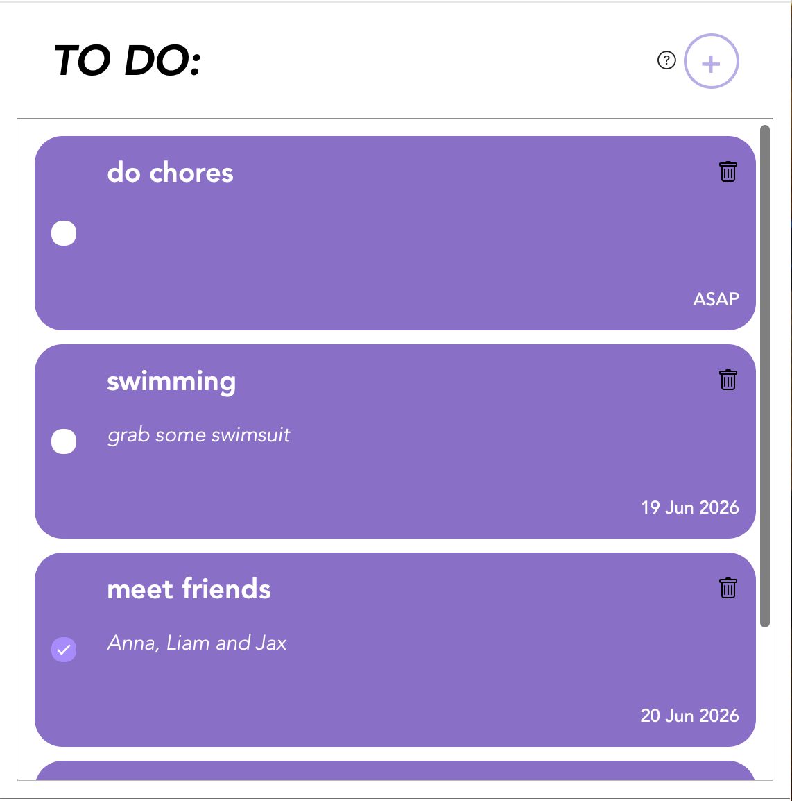
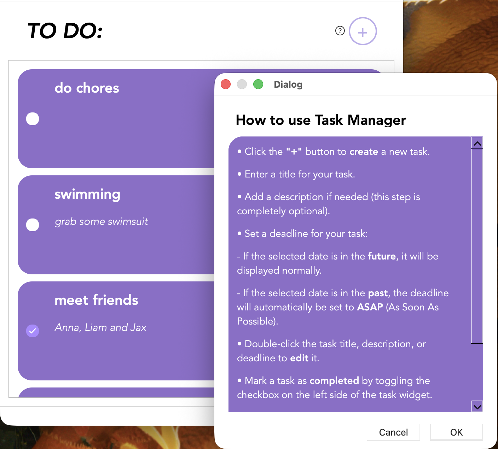

# cpp-task-manager

A simple task manager application written in C++. The project allows users to create, edit, delete, and manage tasks in an easy and organised way.

The project includes two versions:
- **Qt GUI version** – a graphical desktop application with a user interface.
- **Terminal version** – a command-line interface for task management.

Tasks are stored in JSON format using the **nlohmann/json** library:
https://github.com/nlohmann/json
---

## Screenshots

  
  

## How to Use (Qt Version)

- Click the **"+"** button to create a new task.
- Enter a title for your task.
- Add a description if needed (this step is completely optional).
- Set a deadline for your task:
  - If the selected date is in the future, it will be displayed normally.
  - If the selected date is in the past, the deadline will automatically be set to **ASAP** (*As Soon As Possible*).
- Double-click the task title, description, or deadline to edit it.
- Mark a task as completed by toggling the checkbox on the left side of the task widget.
- Delete a task by clicking the trash bin icon in the top-right corner of the task widget.
- If you are unsure what a button or text element does, hover your mouse over it to see a helpful tooltip.
